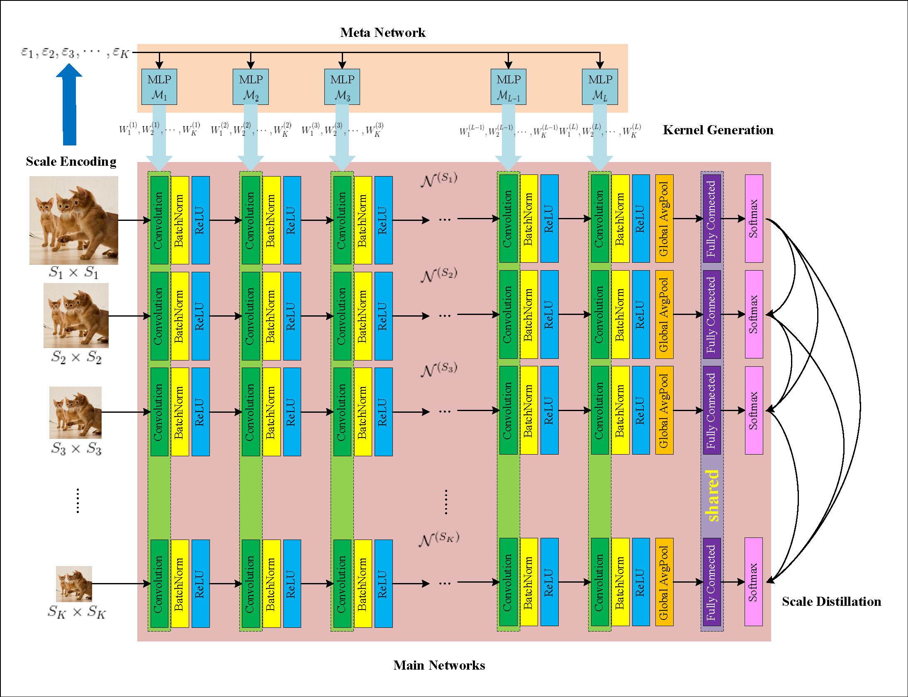
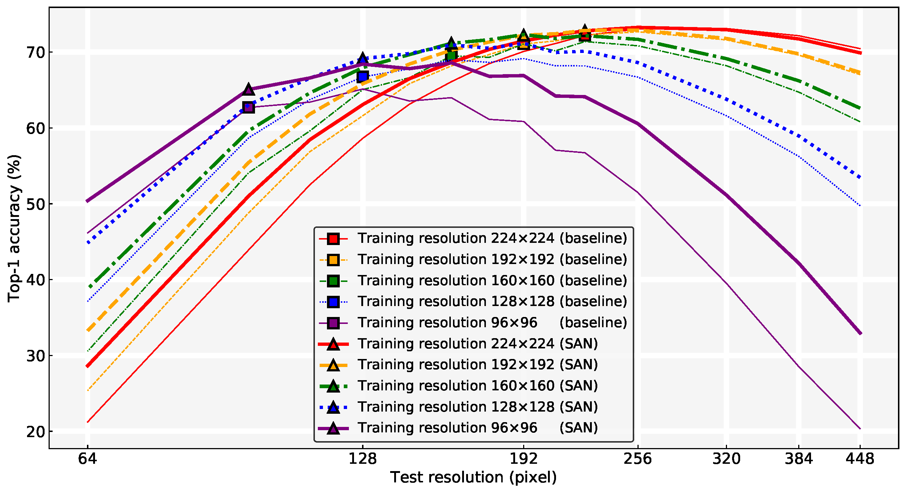
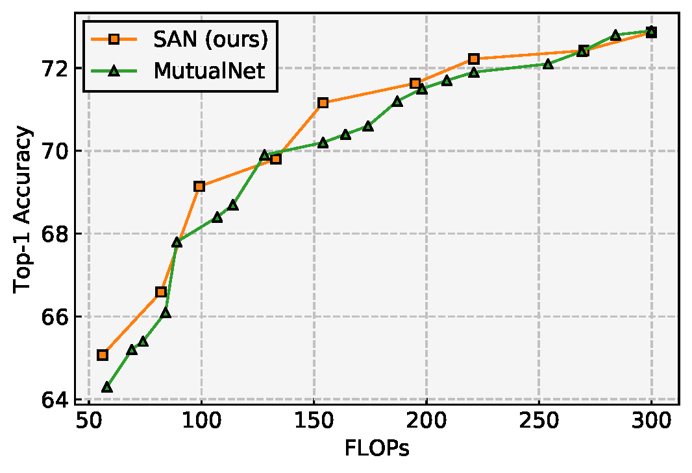

# Scale Adaptive Network
Official implementation of Scale Adaptive Network (SAN) as described in [Learning to Learn Parameterized Classification Networks for Scalable Input Images](https://arxiv.org/abs/2007.06181) (ECCV'20) by  [Duo Li](https://github.com/d-li14), [Anbang Yao](https://github.com/YaoAnbang) and [Qifeng Chen](https://github.com/CQFIO) on the [ILSVRC 2012](http://www.image-net.org) benchmark.

<p align="center"></p>

We present a meta learning framework which dynamically parameterizes main networks conditioned on its input resolution at runtime, leading to efficient and flexible inference for arbitrarily switchable input resolutions.

<p align="center"></p>

## Requirements

### Dependency

* PyTorch 1.0+
* [NVIDIA-DALI](https://github.com/NVIDIA/DALI) (in development, not recommended)

### Dataset

Download the ImageNet dataset and move validation images to labeled subfolders. To do this, you can use the following script: https://raw.githubusercontent.com/soumith/imagenetloader.torch/master/valprep.sh

## Pre-trained Models

### Baseline (individually trained on each resolution)

#### ResNet-18

| Resolution | Top-1 Acc. | Download                                                     |
| ---------- | ---------- | ------------------------------------------------------------ |
| 224x224    | 70.974     | [Google Drive](https://drive.google.com/file/d/1rpOqyLsHi7xuB3XWuXfxE_hojs3zm_BR/view?usp=sharing) |
| 192x192    | 69.754     | [Google Drive](https://drive.google.com/file/d/1fj3S-nzCzgXjIYUYAoA654HO1DNEl_4O/view?usp=sharing) |
| 160x160    | 68.482     | [Google Drive](https://drive.google.com/file/d/1tb9rUsRcw5wWEDREw0Fi1TUTyP73NXjj/view?usp=sharing) |
| 128x128    | 66.360     | [Google Drive](https://drive.google.com/file/d/1LD_s5jZixz8D3TJrjGGjBSKSWO7yb3XT/view?usp=sharing) |
| 96x96      | 62.560     | [Google Drive](https://drive.google.com/file/d/1rfz9aJDJwaadQBmwvzdKwFeQLXSbQF-A/view?usp=sharing) |

### ResNet-50

| Resolution | Top-1 Acc. | Download                                                     |
| ---------- | ---------- | ------------------------------------------------------------ |
| 224x224    | 77.150     | [Google Drive](https://drive.google.com/file/d/1ywPABwm22RRfIFAeidO3hB83WCnjhAa6/view?usp=sharing) |
| 192x192    | 76.406     | [Google Drive](https://drive.google.com/file/d/1psWXD4mkYFqrRzqq6sX54F8c1OxQe2Zo/view?usp=sharing) |
| 160x160    | 75.312     | [Google Drive](https://drive.google.com/file/d/157WAFN1ExnQKFGZSSo7Dzc0ORJ4Ccr14/view?usp=sharing) |
| 128x128    | 73.526     | [Google Drive](https://drive.google.com/file/d/1iC9XiEGKzvCdXYYOhHccdIDW9rQyBmBg/view?usp=sharing) |
| 96x96      | 70.610     | [Google Drive](https://drive.google.com/file/d/14CJg1UQuO8iYrMzKWvWcNxxiL8bZlXwE/view?usp=sharing) |

### MobileNetV2

Please visit my repository [mobilenetv2.pytorch](https://github.com/d-li14/mobilenetv2.pytorch).

### SAN

| Architecture | Download                                                     |
| ------------ | ------------------------------------------------------------ |
| ResNet-18    | [Google Drive](https://drive.google.com/file/d/1JqJSxjD6rMOlxYY44D3QEWH23Lo6XuIF/view?usp=sharing) |
| ResNet-50    | [Google Drive](https://drive.google.com/file/d/1Cci3_vAP_sXVwdUhhtZ2T07KDYUlW_B-/view?usp=sharing) |
| MobileNetV2  | [Google Drive](https://drive.google.com/file/d/1rkl_pV0_HBCVhhwxa1FK6Ec6gxOsjvPT/view?usp=sharing) |

## Training

### ResNet-18/50

```shell
python imagenet.py \
    -a meta_resnet18/50 \
    -d <path-to-ILSVRC2012-data> \
    --epochs 120 \
    --lr-decay cos \
    -c <path-to-save-checkpoints> \
    --sizes <list-of-input-resolutions> \ # default is 224, 192, 160, 128, 96
    -j <num-workers>
    --kd
```

### MobileNetV2

```shell
python imagenet.py \
    -a meta_mobilenetv2 \
    -d <path-to-ILSVRC2012-data> \
    --epochs 150 \
    --lr-decay cos \
    --lr 0.05 \
    --wd 4e-5 \
    -c <path-to-save-checkpoints> \
    --sizes <list-of-input-resolutions> \ # default is 224, 192, 160, 128, 96
    -j <num-workers>
    --kd
```

## Testing

### Proxy Inference (default)

```shell
python imagenet.py \
    -a <arch> \
    -d <path-to-ILSVRC2012-data> \
    --resume <checkpoint-file> \
    --sizes <list-of-input-resolutions> \
    -e
    -j <num-workers>
```

Arguments are:

* `checkpoint-file`: previously downloaded checkpoint file from [here](https://github.com/d-li14/SAN#san).
* `list-of-input-resolutions`: test resolutions using different privatized BNs.

which gives Table 1 in the main paper and Table 5 in the supplementary materials.

### Ideal Inference

Manually set the scale encoding [here](https://github.com/d-li14/SAN/blob/master/models/imagenet/meta_resnet.py#L60), which gives the left panel of Table 2 in the main paper.

Uncomment [this line](https://github.com/d-li14/SAN/blob/master/imagenet.py#L239) in the main script to enable post-hoc BN calibration, which gives the middle panel of Table 2 in the main paper.

### Data-Free Ideal Inference

Manually set the scale encoding [here](https://github.com/d-li14/SAN/blob/master/models/imagenet/meta_resnet.py#L60) and its corresponding shift [here](https://github.com/d-li14/SAN/blob/master/imagenet.py#L124), then uncomment [this line](https://github.com/d-li14/SAN/blob/master/imagenet.py#L209) to replace its above line, which gives Table 6 in the supplementary materials.

## Comparison to MutualNet

[MutualNet: Adaptive ConvNet via Mutual Learning from Network Width and Resolution](https://arxiv.org/abs/1909.12978) is accpepted to ECCV 2020 as **oral**, which highly coincides with our SAN regarding the motivation. We provide a head-to-head comparison of top-1 validation accuracy on ImageNet in the following, based on the common MobileNetV2 backbone.

| Method            | FLOPs      | Top-1 Acc.        |
| ----------------- | ---------- | ----------------- |
| MutualNet<br>SAN  | 300<br>300 | **73.0**<br>72.86 |
| MutualNet<br/>SAN | 269<br>270 | 72.4<br>**72.42** |
| MutualNet<br/>SAN | 221<br>221 | 71.9<br>**72.22** |
| MutualNet<br/>SAN | 198<br>195 | 71.5<br>**71.63** |
| MutualNet<br/>SAN | 154<br>154 | 70.2<br>**71.16** |
| MutualNet<br/>SAN | 138<br>133 | **69.9**<br>69.80 |
| MutualNet<br/>SAN | 99<br>99   | 67.8<br>**69.14** |
| MutualNet<br/>SAN | 84<br>82   | 66.1<br>**66.59** |
| MutualNet<br/>SAN | 58<br>56   | 64.3<br>65.07     |

<p align="center"></p>

We observe that SAN surpasses MutualNet in most computational resource levels by merely switching the input resolution, without further tuing the network width. More importantly, SAN could perform dynamic inference under the desired computational budget in one run, while MutualNet first output a query table by running all possible configurations and then search the result from the query table.

## Citation

If you find our work useful in your research, please consider citing:

```bibtex
@InProceedings{Li_2020_ECCV,
author = {Li, Duo and Yao, Anbang and Chen, Qifeng},
title = {Learning to Learn Parameterized Classification Networks for Scalable Input Images},
booktitle = {The European Conference on Computer Vision (ECCV)},
month = {August},
year = {2020}
}
```
